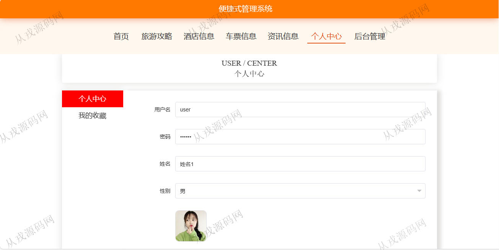

<h1 align="center">143.便捷式旅游管理系统</h1>

- <b>完整代码获取地址：从戎源码网 ([https://armycodes.com/](https://armycodes.com/))</b>
- <b>技术探讨、资料分享，请加QQ群：692619798</b> 
- <b>作者微信：19941326836  QQ：952045282</b> 
- <b>承接计算机毕业设计、Java毕业设计、Python毕业设计、深度学习、机器学习</b>
- <b>选题+开题报告+任务书+程序定制+安装调试+论文+答辩ppt 一条龙服务</b>
- <b>所有选题地址 ([https://github.com/YuLin-Coder/AllProjectCatalog](https://github.com/YuLin-Coder/AllProjectCatalog)) </b>

## 项目介绍
基于springboot+vue的便捷式旅游管理系统：前端 vue、elementui，后端 maven、springmvc、spring、mybatis；角色分为管理员、用户；集成旅游攻略、酒店预定、车票购买等功能于一体的系统。

## 功能介绍

### 用户

- 基本功能：登录，注册，退出
- 网站首页：主导航栏，轮播图，资讯信息，旅游攻略展示，酒店信息展示，车票信息展示
- 旅游攻略：旅游攻略列表搜索查询，攻略详情，收藏，赞一下，踩一下，评论
- 酒店信息：酒店信息按名称搜索，酒店信息详情，酒店在线预定
- 车票信息：车票信息搜索查询，在线购票
- 资讯信息：资讯列表展示，资讯详情查看
- 个人中心：个人信息查看与修改，我的收藏列表查看

### 管理员

- 用户管理：用户信息的查看，用户数据由前台自行注册而来，管理员可以对用户数据进行修改和删除
- 旅游攻略管理：攻略信息的增删改查
- 房间类型管理：房间类型信息的增删改查
- 酒店信息管理：酒店信息的增删改查，查看评论，酒店图片上传，内容编辑支持富文本
- 酒店预定管理：用户前台预定酒店后，管理员可以在后台查看预定信息
- 车票管理：车票信息的增删改查

## 环境

- <b>IntelliJ IDEA 2021.3</b>

- <b>Mysql 5.7.26</b>

- <b>Node 14.14.0</b>

- <b>JDK 1.8</b>

## 运行截图

